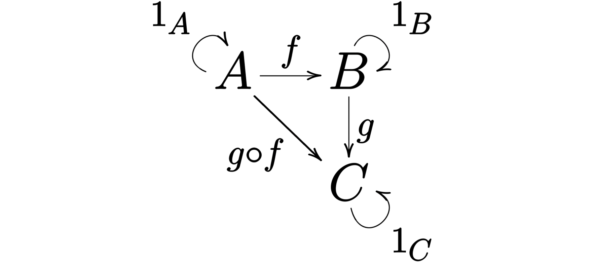

본 포스트는 fp-ts 공식 문서의 [Learning Resources](https://gcanti.github.io/fp-ts/learning-resources/)에 있는 Getting Started에서 소개하는 문서들을 번역하며 학습한 문서입니다. 원본 문서는 [링크](https://dev.to/gcanti/getting-started-with-fp-ts-category-4c9a)에서 확인할 수 있으며 작성한 코드들은 [여기](https://github.com/alstn2468/getting-started-fp-ts/tree/main/src/5_category)에서 확인할 수 있습니다.

## fp-ts 시작하기 (Category)

지난 포스트에서 우리는 함수형 프로그래밍에 사용되는 몇 가지 기본 추상화인 [Eq](https://alstn2468.github.io/TypeScript/2021-04-24-fp-ts-1/), [Ord](https://alstn2468.github.io/TypeScript/2021-04-25-fp-ts-2/), [Semigroup](https://alstn2468.github.io/TypeScript/2021-04-25-fp-ts-3/)과 [Monoid](https://alstn2468.github.io/TypeScript/2021-04-29-fp-ts-4/)를 보았습니다.

다음 포스트에서는 함수형 프로그래밍을 더욱더 흥미롭게 만드는 몇 가지 고급 추상화를 살펴볼 것입니다.

이야기적으로 [fp-ts](https://github.com/gcanti/fp-ts)에 포함된 첫 번째 고급 추상화는 `Functor`지만, `Functor`에 관해 이야기하기 전에 `Functor`를 만들기 위해 필요한 **카테고리**에 대해 배울 필요가 있습니다.

함수형 프로그래밍의 초석은 **조합**입니다. 그러나 이것이 정확히 무엇을 의미할까요? 두 가지가 *조합*된다고 말할 수 있을까요? 그리고 그것이 언제 모든 것이 *잘 조합*된다고 말할 수 있을까요?

우리는 조합에 대한 **공식적인 정의**가 필요합니다. 그것이 카테고리에 관한 모든 것입니다.

> 카테고리는 조합의 본질을 포착합니다.

## 카테고리

카테고리의 정의는 약간 길기 때문에 두 부분으로 나눌 것입니다.

- 첫 번째는 기술적인 것입니다. (우선 조합 요소를 정의해야 합니다).
- 두 번째 부분에는 우리가 가장 관심을 갖는 내용인 조합 개념이 포함됩니다.

### Part I (정의)

카테고리는 `(Objects, Morphisms)` 쌍입니다.

- `Objects`는 객체 모음입니다.
- `Morphisms`은 객체 사이의 형태 (또는 화살표) 모음입니다.

> 참고: 여기에서 "객체"라는 용어는 OOP와는 아무 관련이 없습니다. 객체를 검사할 수없는 블랙박스 또는 Morphisms을 위한 보조 자리 표시자로 생각할 수 있습니다.

각 `Morphisms` `f`에는 소스 객체 `A`와 대상 객체 `B`가 있으며 `A`와 `B`는 `Objects`입니다.

우리는 `f : A ⟼ B`라고 쓰고 "f는 A에서 B로의 형태"라고 말합니다.

### Part II (조합)

아래 속성을 유지해야 하는 "조합"이라는 작업 `∘`가 있습니다.

- 형태의 조합(**Composition of morphisms**): `f : A ⟼ B` ​​및 `g : B ⟼ C`가 `Morphisms`에서 두 가지 형태이면 세 번째 `Morphisms`인 `f`와`g`의 조합인 `A ⟼ C` 형태의 `g ∘ f`가 있어야 합니다.
- 연관성(**Associativity**): 만약 `f : A ⟼ B`, `g : B ⟼ C`와 `h : C ⟼ D` 를 만족한다면 `h ∘ (g ∘ f) = (h ∘ g) ∘ f`를 만족해야 합니다.
- 동일성(**Identity**): 모든 객체 `X`에 대해 `X ⟼ X`는 `X`에 대한 *동일성 형태*라고 불립니다. 따라서 모든 형태 `f : A ⟼ X` 및 모든 형태 `g : X ⟼ B`에 대해 `identity ∘ f = f` 및 `g ∘ identity = g`를 만족해야 합니다.

#### 예시

<figure>
  
  <figcaption>
    출처:
    <a href="https://en.wikipedia.org/wiki/Category_(mathematics)">
      Wikipedia.org의 카테고리
    </a>
  </figcaption>
</figure>

이 카테고리는 매우 간단합니다. 3개의 객체와 6개의 형태만 있습니다 ($$ 1_A $$, $$ 1_B $$, $$ 1_C $$는 A, B, C의 동일 형태입니다).

## 프로그래밍 언어로서의 카테고리

카테고리는 **타입화 된 프로그래밍 언어**의 단순화 된 모델로 해석될 수 있습니다.

- 객체는 **타입**입니다
- 형태는 **함수**입니다
- `∘`는 일반적인 **함수 조합**입니다.

아래의 다이어그램은 단지 세 가지 타입과 작은 함수들이 있는 매우 단순한 가상의 프로그래밍 언어로 해석될 수 있습니다.


예를 들면 아래와 같습니다.

- `A = string`
- `B = number`
- `C = boolean`
- `f = string => number`
- `g = number => boolean`
- `g ∘ f = string => boolean`

실제 구현은 아래와 같을 수 있습니다.

```typescript
function f(s: string): number {
  return s.length;
}

function g(n: number): boolean {
  return n > 2;
}

// h = g ∘ f
function h(s: string): boolean {
  return g(f(s));
}
```

## 타입스크립트를 위한 카테고리

TypeScript 언어의 모델로 *TS*라는 이름을 갖는 카테고리를 정의 할 수 있습니다.

- **객체**는 모든 TypeScript 타입입니다 : `string`, `number`, `Array<string>`, ...
- **형태**는 모든 TypeScript 함수입니다 : `(a : A) => B`, `(b : B) => C`, ... 여기서 `A`, `B`, `C`, ...는 TypeScript 타입입니다.
- **동일 형태**는 모두 단일 다형성 함수로 인코딩됩니다 `const identity = <A>(a : A) : A => a`
- **형태의 조합**은 일반적인 연관된 함수 조합입니다.

TypeScript의 모델로서 *TS*는 너무 제한적으로 보일 수 있습니다. 반복문도, 조건문도, 거의 아무것도 사용하지 않습니다. 그런데도 이 단순화된 모델은 우리의 주요 목적인 잘 정의된 조합 개념에 대한 이유를 만족하기에 충분합니다.

## 조합의 핵심 문제

*TS*에서 우리는 두 가지 제네릭 함수 `f : (a : A) => B` 및 `g : (c : C) => D`를 `B = C`를 만족하는 경우에 조합할 수 있습니다.

```typescript
function compose<A, B, C>(g: (b: B) => C, f: (a: A) => B): (a: A) => C {
  return a => g(f(a));
}
```

그러나 `B != C`이면 어떻게 할 수 있을까요? 이러한 함수를 어떻게 조합 할 수 있을까요? 포기해야 할까요?

다음 포스트에서는 어떤 조건에서 그러한 조합이 가능한지 살펴보며 `Functor`에 대해 이야기해보겠습니다.
