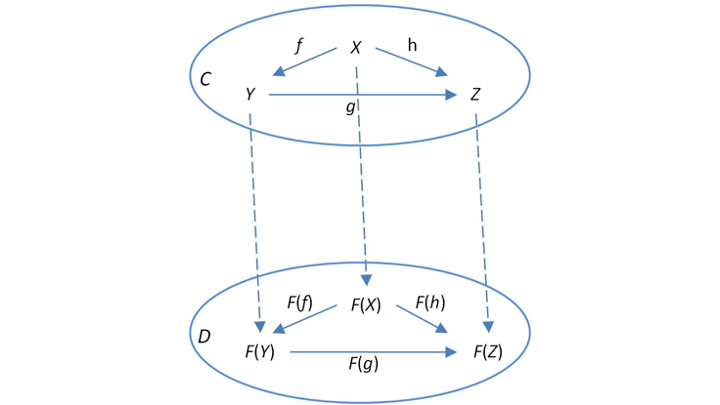

본 포스트는 fp-ts 공식 문서의 [Learning Resources](https://gcanti.github.io/fp-ts/learning-resources/)에 있는 Getting Started에서 소개하는 문서들을 번역하며 학습한 문서입니다. 원본 문서는 [링크](https://dev.to/gcanti/getting-started-with-fp-ts-functor-36ek)에서 확인할 수 있으며 작성한 코드들은 [여기](https://github.com/alstn2468/getting-started-fp-ts/tree/main/src/6_functor)에서 확인할 수 있습니다.

## fp-ts 시작하기 (Functor)

카테고리에 대한 [지난 포스트](https://alstn2468.github.io/TypeScript/2021-05-01-fp-ts-5/)에서 _TS_ 카테고리 (TypeScript 카테고리)와 함수 조합의 핵심 문제를 제시했습니다.

> 두 가지 일반 함수 `f: (a: A) => B`와 `g: (c: C) => D`를 어떻게 조합할 수 있을까요?

이 문제에 대한 해결책을 찾는 것이 왜 그렇게 중요할까요?

왜냐하면 카테고리가 프로그래밍 언어를 모델링하는 데 사용될 수 있다면, 형태(즉, *TS*의 함수)는 **프로그램**을 모델링하는 데 사용될 수 있기 때문입니다.

따라서 문제를 해결하는 것은 **일반적인 방식으로 프로그램을 조합하는 방법을 찾는 것**을 의미하기도 합니다. 그리고 이것은 개발자에게 꽤 흥미롭지 않을까요?

## 프로그램으로서의 함수

**순수 프로그램**을 다음과 같은 시그니처를 가진 함수라고 부릅니다.

```typescript
(a: A) => B;
```

이 시그니처는 `A` 타입의 입력을 받고 이펙트 없이 타입 `B`의 결과를 생성하는 프로그램 모델입니다.

**이펙트 있는 프로그램**을 아래와 같은 시그니처를 가진 함수라고 부릅니다.

```typescript
(a: A) => F<B>
```

이 시그니처는 `A`타입 입력을 받고 **이펙트** `F`와 함께 유형 `B`의 결과를 생성하는 프로그램 모델입니다. 여기서 `F`는 타입 생성자입니다.

[타입 생성자](https://en.wikipedia.org/wiki/Type_constructor)는 0개 이상의 타입 인자를 받고 다른 형식을 반환하는 `n`항 형식 연산자입니다.

### 예시

타입 `string`이 주어지면 `Array` 타입 생성자는 타입 `Array<string>`를 반환합니다.

여기서 우리는 `n >=` 1인 `n`항 생성자에 관심이 있습니다.

| 타입 생성자 | 이펙트 (해석)          |
| :---------- | :--------------------- |
| `Array<A>`  | 비결정론적 연산        |
| `Option<A>` | 실패할지도 모르는 연산 |
| `Task<A>`   | 비동기 연산            |

이제 아래 주요 문제로 돌아갈 수 있습니다.

> 두 가지 일반 함수 `f: (a: A) => B`와 `g: (c: C) => D`를 어떻게 조합할 수 있을까요?

일반적인 문제는 다루기 어렵기 때문에 `B`와 `C`에 제약을 가할 필요가 있습니다.

우리는 이미 `B = C`이면 일반적인 함수 조합이 가능하다는 것을 정답으로 알고 있습니다.

```typescript
function compose<A, B, C>(g: (b: B) => C, f: (a: A) => B): (a: A) => C {
  return a => g(f(a));
}
```

다른 경우는 어떻게 할 수 있을까요?

## 제약 조건 `B = F<C>`가 Functor로 연결되는 경우

`B = F<C>`의 일부 타입 생성자 `F` 또는 다른 말로 바꿔 아래와 같은 제약 조건을 고려해 볼 수 있습니다.

- `f: (a: A) => F<B>`는 이펙트가 있는 프로그램입니다.
- `g: (b: B) => C`는 순수한 프로그램입니다.

`f`를 `g`로 조합하기 위해 함수 `(b: B) => C`에서 함수 `(fb: F<B>) => F <C>`로 `g`를 **들어 올려**(`lift`) 일반적인 함수 조합을 사용할 수 있습니다. (`f`의 반환 타입은 들어 올려진 함수의 입력 타입과 동일합니다)

원래의 문제를 다른 문제로 바꿨습니다. 그렇다면 그런 `lift` 함수를 찾을 수 있을까요?

몇 가지 예시를 살펴볼 수 있습니다.

### 예시 (`F = Array`)

```typescript
function arrayLift<B, C>(g: (b: B) => C): (fb: Array<B>) => Array<C> {
  return fb => fb.map(g);
}
```

### 예시 (`F = Option`)

```typescript
import type { Option } from 'fp-ts/lib/Option';
import { isNone, some, none } from 'fp-ts/lib/Option';

function lift<B, C>(g: (b: B) => C): (fb: Option<B>) => Option<C> {
  return (fb) => (isNone(fb) ? none : some(g(fb.value)));
}
```

### 예시 (`F = Task`)

```typescript
import type { Task } from 'fp-ts/lib/Task';

function lift<B, C>(g: (b: B) => C): (fb: Task<B>) => Task<C> {
  return (fb) => () => fb().then(g);
}
```

모든 `lift` 함수는 거의 동일하게 보이지만 우연이 아닙니다. 모두 아래에 함수적인 패턴이 있습니다.

실제로 이러한 모든 타입 생성자(그리고 다른 많은 것들)는 **Functor 인스턴스**를 허용합니다.

## Functor

`Functor`는 카테고리 구조를 보존하는 **카테고리 간의 매핑**입니다. 즉, 동일 형태와 조합을 보존합니다.

카테고리는 두 가지 (객체와 형태)로 구성되므로 `Functor`도 두 가지로 구성됩니다.

- *C*의 각 객체 `X`와 *D*의 객체와 관련된 **객체 간의 매핑**
- *C*의 각 형태와 *D*의 형태와 연관되는 **형태 간의 매핑**

여기서 *C*와 *D*는 두 가지 카테고리(일명 두 가지 프로그래밍 언어)입니다.

<figure>
  
  <figcaption>
    [출처:
    <a href="https://ncatlab.org/nlab/show/functor">
      ncatlab.org의 Functor
    </a>]
  </figcaption>
</figure>

서로 다른 두 프로그래밍 언어 간의 매핑이 흥미로운 아이디어라고 해도 *C*와 *D*가 일치하는 매핑(*TS*와 함께)에 더 관심이 있습니다. 이 경우에는 **endofunctor**("endo"는 "내부", "내부"를 의미)에 대해 이야기합니다.

지금부터 `Functor`를 사용할 때에는 실제로 *TS*에서 **endofunctor**를 의미합니다.

## 정의

`Functor`는 `(F, lift)` 쌍입니다.

- `F`는 각 타입 `X`를 타입 `F<X>`(**객체 간 매핑**)에 매핑하는 `n`항 타입 생성자 (`n >= 1`)입니다.
- `lift`는 아래와 같은 시그니처가 있는 함수입니다.

```typescript
lift: <A, B>(f: (a: A) => B) => ((fa: F<A>) => F<B>)
```

각 함수 `f: (a: A) => B`를 함수 `lift(f): (fa: F<A>) => F<B>` (**형태 간 매핑**)에 매핑합니다.

`Functor`는 아래와 같은 속성이 유지되어야 합니다.

- <code class="language-text">lift(identity<sub>X</sub>)</code> = <code class="language-text">identity<sub>F(X)</sub></code>: **Identity가 Identity에 매핑 되어야 한다**.
- `lift(g ∘ f)` = `lift(g) ∘ lift(f)`: **조합 매핑은 매핑의 조합이다**.

`lift` 함수는 `map`이라는 변형으로도 알려져 있으며 기본적으로 `lift`는 인자가 재배치 되어있습니다.

```typescript
lift: <A, B>(f: (a: A) => B) => ((fa: F<A>) => F<B>)
map:  <A, B>(fa: F<A>, f: (a: A) => B) => F<B>
```

> 참고: `map`은 `lift`에서 파생될 수 있으며 반대도 마찬가지로 가능합니다.

## `fp-ts`에서의 Functor

`fp-ts`에서 `Functor` 인스턴스를 어떻게 정의할 수 있을까요? 실제 예시를 확인해 볼 수 있습니다.

아래의 인터페이스 선언은 API 호출 응답 모델을 정의합니다.

```typescript
interface Response<A> {
  url: string;
  status: number;
  headers: Record<string, string>;
  body: A;
}
```

`body` 필드는 매개 변수화되어 있으므로 `Response`는 `n >= 1`인 `n`항 타입 생성자(필요한 전제 조건)이므로 `Response`가 `Functor` 인스턴스에 적합한 후보가 될 수 있습니다.

`Response`에 대한 `Functor` 인스턴스를 정의하려면 `fp-ts`에서 요구하는 일부 [기술](https://gcanti.github.io/fp-ts/modules/HKT.ts.html)과 함께 `map` 함수를 정의해야 합니다.

```typescript
import { Functor1 } from 'fp-ts/lib/Functor';

const URI = 'Response';

type URI = typeof URI;

declare module 'fp-ts/lib/HKT' {
  interface URItoKind<A> {
    Response: Response<A>;
  }
}

interface Response<A> {
  url: string;
  status: number;
  headers: Record<string, string>;
  body: A;
}

function map<A, B>(fa: Response<A>, f: (a: A) => B): Response<B> {
  return { ...fa, body: f(fa.body) };
}

// `Response`를 위한 Functor 인스턴스
export const functorResponse: Functor1<URI> = {
  URI,
  map,
};
```

## 일반적인 문제가 해결되었을까요?

전혀 해결되지 않았습니다. `Functor`를 사용하면 순수 프로그램 `g`로 효과적인 프로그램 `f`를 구성할 수 있지만, `g`는 단항이어야 합니다. 즉, 입력으로 하나의 인자만 허용해야 합니다. `g`가 두 개 또는 세 개의 인수를 받아들이면 어떻게 할 수 있을까요?

| 프로그램 f    | 프로그램 g             | 조합          |
| :------------ | :--------------------- | :------------ |
| 순수함        | 순수함                 | `g ∘ f`       |
| 이펙트가 있는 | 순수함(단항)           | `lift(g) ∘ f` |
| 이펙트가 있는 | 순수한(`n`항, `n > 1`) | ?             |

이러한 상황을 처리하기 위해서는 더 많은 것이 필요합니다. 다음 포스트에서는 함수형 프로그래밍의 또 다른 놀라운 추상화인 **Applicative Fuctor**에 대해 이야기할 것입니다.

> 요약 : 함수형 프로그래밍은 조합에 관한 것입니다.
