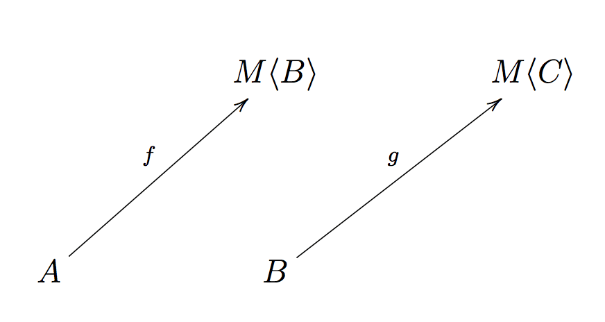

본 포스트는 fp-ts 공식 문서의 [Learning Resources](https://gcanti.github.io/fp-ts/learning-resources/)에 있는 Getting Started에서 소개하는 문서들을 번역하며 학습한 문서입니다. 원본 문서는 [링크](https://dev.to/gcanti/getting-started-with-fp-ts-monad-6k)에서 확인할 수 있으며 작성한 코드들은 [여기](https://github.com/alstn2468/getting-started-fp-ts/tree/main/src/8_monad)에서 확인할 수 있습니다.

## fp-ts 시작하기 (Monad)

[지난 포스트](https://alstn2468.github.io/TypeScript/2021-05-01-fp-ts-6/)에서 우리는 `M`이 Applicative 인스턴스를 인정한다면 `g`를 들어 올림으로써 순수한 `n`항 프로그램 `g`로 이펙트 있는 프로그램 `f: (a: A) => M<B>`를 구성할 수 있음을 보았습니다.

| 프로그램 f  |  프로그램 g   |      조합       |
| :---------: | :-----------: | :-------------: |
|   순수한    |    순수한     |     `g ∘ f`     |
| 이펙트 있는 | 순수한, `n`항 | `liftAn(g) ∘ f` |

그러나 마지막 한 가지 경우를 해결해야 합니다. **두 프로그램이 모두** 이펙트가 있다면 어떻게 할 수 있을까요?

```typescript
f: (a: A) => M<B>
g: (b: B) => M<C>
```

그런 `f`와 `g`의 "조합"은 무엇일까요?

이 마지막 경우를 처리하기 위해서는 중첩된 컨텍스트로 끝나기 쉽기 때문에 `Functor`보다 더 강력한 것이 필요합니다.

## 문제: 중첩된 컨텍스트

더 많은 것이 필요한 이유를 더 잘 설명하기 위해 몇 가지 예시를 살펴보겠습니다.

### 예시 (`M = Array`)

트위터 사용자의 팔로워를 검색하고 싶다고 가정해 보겠습니다.

```typescript
interface User {
  followers: Array<User>;
}

const getFollowers = (user: User): Array<User> => user.followers;

const followersOfFollowers = (user: User): Array<Array<User>> =>
  getFollowers(user).map(getFollowers);
```

뭔가 잘못된 것이 있습니다. `followersOfFollowers` 함수의 반환 타입은 `Array<Array<User>>`이지만 우리는 `Array<User>` 타입을 반환하기를 원합니다.

우리는 중첩된 배열을 **평평하게** 만들어야 합니다.

`fp-ts`에서 제공하는 `flatten: <A>(mma: Array<Array<A>>) => Array<A>` 함수를 사용하면 편리합니다.

```typescript
import { flatten } from 'fp-ts/lib/Array';

const followersOfFollowers = (user: User): Array<User> =>
  flatten(getFollowers(user).map(getFollowers));
```

좋습니다. 다른 데이터 구조는 어떨까요?

### 예시 (`M = Option`)

숫자 목록의 가장 앞의 데이터의 역수를 계산하고 싶다고 가정해 보겠습니다.

```typescript
import { Option, some, none, option } from 'fp-ts/lib/Option';
import { head } from 'fp-ts/lib/Array';

const inverse = (n: number): Option<number> => (n === 0 ? none : some(1 / n));

const inverseHead = (arr: Array<number>): Option<Option<number>> =>
  option.map(head(arr), inverse);
```

다시 한번 발생했습니다. `inverseHead` 함수는 `Option<Option<number>>` 타입을 반환하고 있지만 우리는 `Option<number>` 타입이 반환되기를 원합니다.

우리는 중첩된 `Option`을 **평평하게** 만들어야 합니다.

```typescript
import { isNone } from 'fp-ts/lib/Option';

const flatten = <A>(mma: Option<Option<A>>): Option<A> =>
  isNone(mma) ? none : mma.value;

const inverseHead = (arr: Array<number>): Option<number> =>
  flatten(option.map(head(arr), inverse));
```

모든 `flatten` 함수들은 우연히 생긴 것이 아닙니다. 이것들은 모두 안에 함수형적인 패턴이 존재합니다.

실제로 이러한 모든 타입 생성자(및 기타 많은 생성자)는 **Monad 인스턴스**를 허용하고 있습니다.

> `flatten`은 Monad의 가장 고유한 기능입니다.

그래서 Monad는 무엇인가요?

아래 내용이 Monad가 자주 제시되는 방식입니다.

## 정의

Monad는 아래와 같이 세 가지로 정의됩니다.

(1) [Functor](https://alstn2468.github.io/TypeScript/2021-05-02-fp-ts-6/) 인스턴스를 허용하는 타입 생성자 `M`

(2) 아래의 시그니처를 갖는 `of` 함수

```typescript
of: <A>(a: A) => HKT<M, A>
```

(3) 아래 시그니처를 갖는 `flatMap` 함수

```typescript
flatMap: <A, B>(f: (a: A) => HKT<M, B>) => ((ma: HKT<M, A>) => HKT<M, B>)
```

> `HKT` 타입은 제네릭 타입 생성자를 나타내는 `fp-ts` 방식이며 `HKT<M, X>`는 타입 `X`에 적용된 타입 생성자 `M` (즉, `M<X>`)을 생각할 수 있습니다.

`of`와 `flatMap` 함수는 아래의 세 가지 조건을 만족해야 합니다.

- **왼쪽 항등식**(Left identity): `flatMap(of) ∘ f = f`
- **오른쪽 항등식**(Right identity): `flatMap(f) ∘ of = f`
- **연관성**(Associativity): `flatMap(h) ∘ (flatMap(g) ∘ f) = flatMap((flatMap(h) ∘ g)) ∘ f`

여기서 `f`, `g`, `h`는 모두 이펙트가 있는 함수이고 `∘`는 일반적인 함수 조합입니다.

## 좋습니다. 그런데 왜?

이런 정의를 처음 보았을 때 첫 반응은 당황했습니다.

아래의 모든 질문이 내 머릿속에서 맴돌고 있었습니다.

- 왜 그 두 가지 특정한 기능을 하고 왜 그런 타입을 갖고 있나요?
- 왜 이름이 "flatMap"일까요?
- 왜 규칙들이 있고 그것들은 무엇을 의미할까요?
- 하지만 무엇보다도 `flatten`은 어디에 있을까요?

이 포스트에서는 각 질문에 대한 답변을 시도합니다.

문제로 돌아가 보겠습니다. 두 개의 이펙트 있는 함수(**Kleisli arrows**라고도 함)의 조합은 무엇입니까?

<figure>
  
  <figcaption>
    두 개의 Kleisli arrows의 조합은 무엇입니까?
  </figcaption>
</figure>

나는 그것의 타입이 무엇인지조차 모릅니다.

잠깐... 우리는 이미 조합에 관한 추상화를 만났습니다. [카테고리](https://alstn2468.github.io/TypeScript/2021-05-01-fp-ts-5/)에 관해 얘기한 것을 기억하고 있습니까?

> 카테고리는 조합의 본질을 포착합니다.

우리는 이 문제를 카테고리 문제로 바꿀 수 있습니다. Kleisli arrows의 조합 모델에 맞는 카테고리를 찾을 수 있습니까?

## Kleisli 카테고리

## 우리는 단계별로 조합을 구성합니다.

## 법칙

## `fp-ts`의 Monad

## 결론
